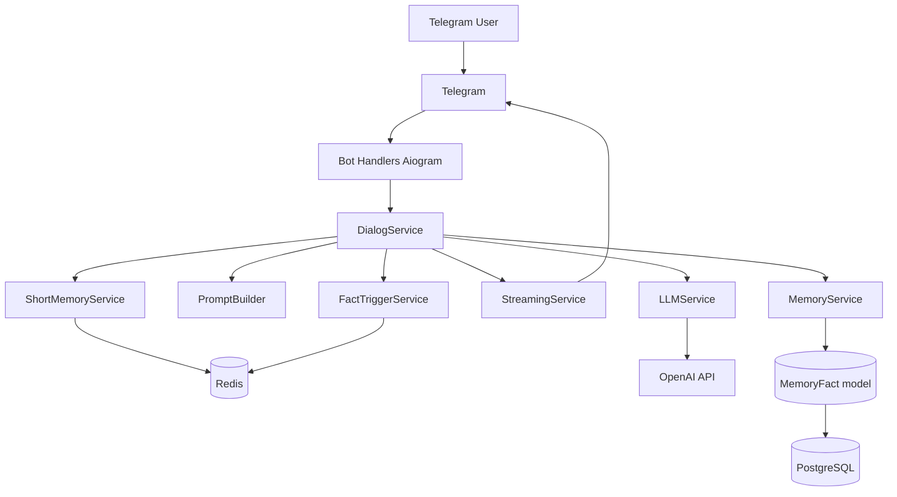
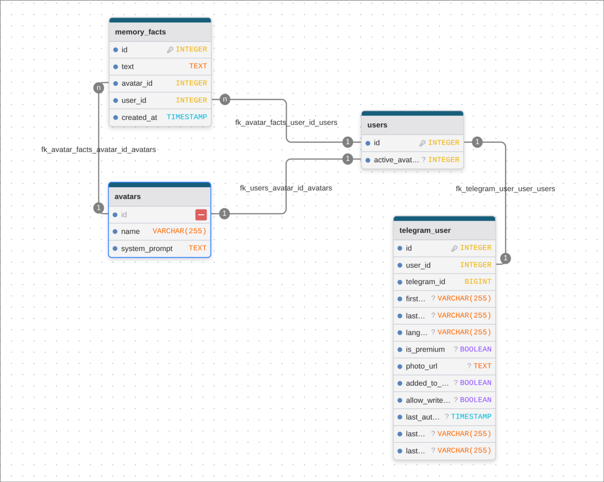

# Telegram AI Avatars Bot

This project is a Django + Aiogram backend for a Telegram bot where users chat with AI avatars.  
Each avatar has its own personality (`system_prompt`), the bot streams replies, stores short-term dialog context in Redis, and keeps long-term user facts in PostgreSQL.

## 🎥 Demo

[](https://youtu.be/smt0Hv9M7wk)

## Link
[@avatarschatbot](t.me/avatarschatbot)

## Architecture



## Database Schema

- Interactive schema (drawDB): [open schema](https://www.drawdb.app/editor?shareId=b0cb817902f0d0e4f30ad19f02a2f893)

### Schema Screenshot



## Environment Setup

Create a local environment file from the template before any run:

```bash
cp .env.example .env
```

Then fill required variables in `.env` (at minimum: `DJANGO_*`, `POSTGRES_*`, `BOT_TOKEN`, `OPENAI_API_KEY`, `REDIS_URL`).

## Run Locally (via justfile)

This project uses [`just`](https://github.com/casey/just) as a command runner.

Example local workflow:

```bash
# install dependencies
uv sync --frozen

# run database in Docker and Django server locally
just run

# run Telegram bot locally
just runbot
```

Useful command aliases are defined in `justfile` (`just mmm`, `just migrate`, `just up`, etc.).

## Run with Docker

```bash
# make sure .env exists
cp .env.example .env

# start full stack
docker compose up --build
```

Main services:
- `django` — web/backend process
- `bot` — Telegram polling worker (`manage.py runbot`)
- `postgres` — primary database
- `redis` — short-term memory and counters

